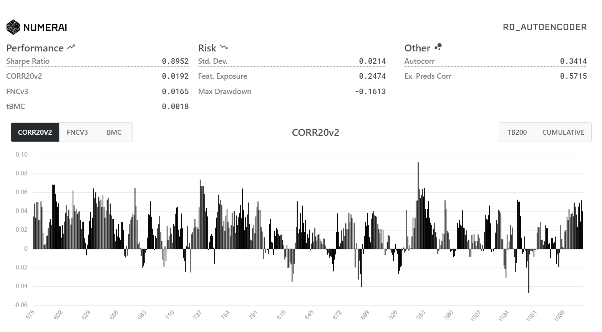

# NumerAI
Models trained on the NumerAI dataset for BA865 - Intro to Neural Networks
Contributors - [@BoyuanChen](https://www.github.com/BoyuanChen0104), [@FreyaJiang](https://www.github.com/FreyaJiang0104) & [@d-roho](github.com/d-roho)
## Our Best Model - Autoencoder + MLP

